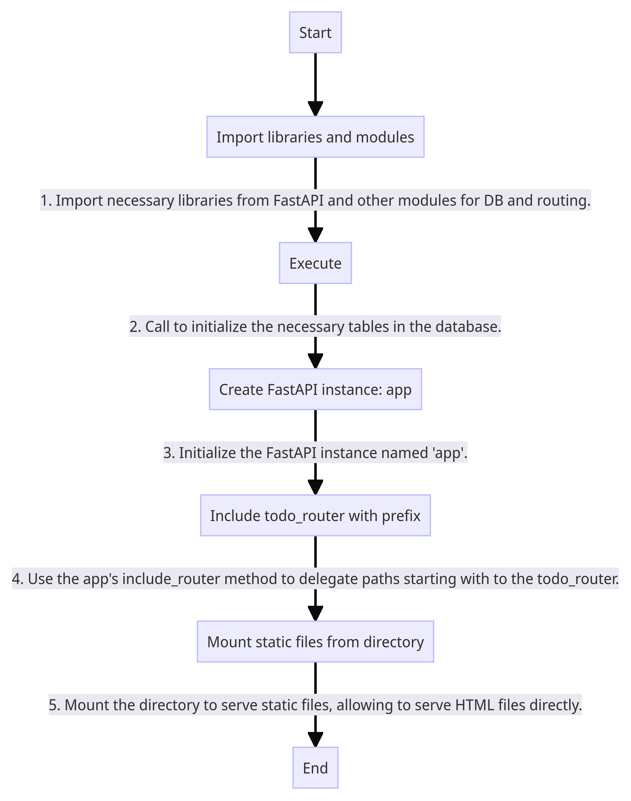
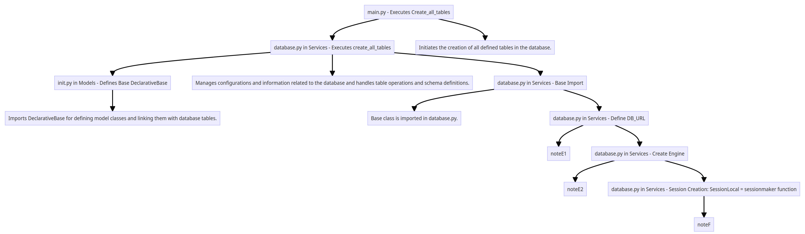
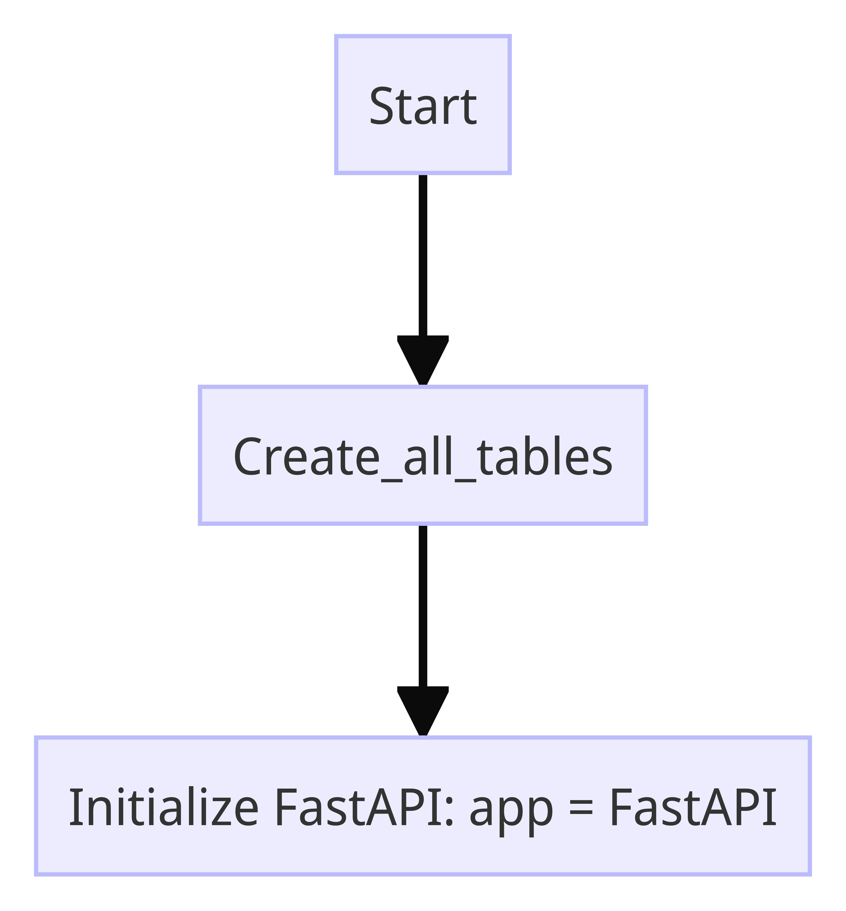
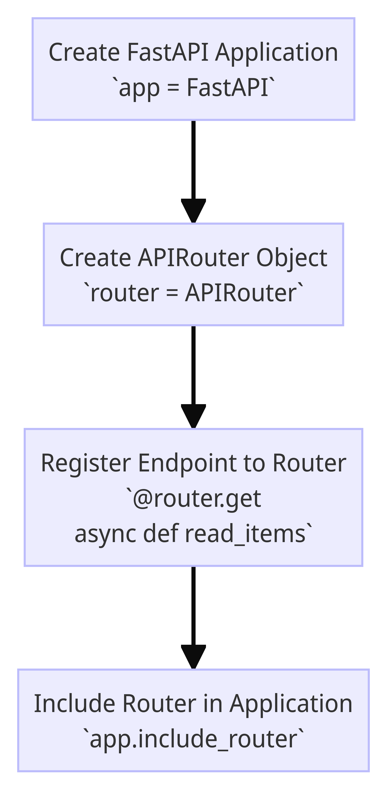

# FastAPI Flow Documentation

the flow of setting up a FastAPI application, as "main.py"

# create_all_tables()

## noteE1[Indicates connection to an SQLite in-memory database.]
## noteE2[Connects to SQLite with considerations for single-threaded safety.]
## noteF[After creating a database engine and tables, sessionmaker configures a database session for interactions. It provides configurations like autocommit transaction management and autoflush preparing session changes without committing. Transactions group database operations logically. SessionLocal in SQLAlchemy initiates sessions crucial for managing connections, transactions, and operations.]

## step A : main.py - Executes Create_all_tables

### Initiates the creation of all defined tables in the database. In FastAPI applications, this ensures consistency between models and database schema, setting the initial schema and establishing a link between the database and data models. The process plays a crucial role in adding or modifying tables in the database.

## step B : database.py in Services - Executes create_all_tables

### SQLAlchemy's metadata object manages database-related configurations and information. Using this object, one can handle database table operations like creation, modification, deletion, and manage schema definitions and model-database mappings. Typically, model classes are defined using SQLAlchemy, which then initializes the metadata object. The Base class is the foundational class in SQLAlchemy, and models inheriting from it share the metadata object. The method Base.metadata.create_all(bind=engine) creates tables defined in metadata in the database. The bind=engine argument specifies which database engine to connect to, using the engine object to create tables in the database.

## step C : init.py in Models - Defines Base(DeclarativeBase)

### Imports DeclarativeBase from the SQLAlchemy package. DeclarativeBase is the base class used in SQLAlchemy for defining model classes. By inheriting from this class, one can utilize SQLAlchemy's ORM (Object-Relational Mapping) capabilities to link database tables and model classes. Within the class, no members or methods are added; it simply uses the pass statement, indicating that the class is defined but contains no content.

## step E1 : database.py in Services - Define DB_URL
 
### sqlite:/// signifies a connection to an SQLite database, and :memory: indicates creating the database in memory. In-memory databases are temporary, storing data transiently, and the data vanishes when the program ends. SQLAlchemy's engine is compatible with various database systems, facilitating switching to different database systems without code modifications. By default, SQLite operates safely only in single-threaded environments. Issues can arise if one thread opens and uses a database connection while another thread tries to use the same connection simultaneously.

## step E2 : database.py in Services - Create Engine
 
### create_engine connects to an SQLite database, indicated by sqlite:///. Using :memory: means the database is created in memory. This in-memory database temporarily stores data, and data is lost once the program ends. The SQLAlchemy engine supports multiple database systems, allowing seamless switches between different databases without changing the code. SQLite primarily functions safely in a single-threaded environment; issues might occur if multiple threads attempt to access the database concurrently.

## step F
 
### "After creating a database engine with create_engine and generating tables using Base.metadata.create_all(bind=engine), the sessionmaker function establishes and configures a database session, enabling interaction with the database using the set engine and session. The sessionmaker provides numerous configurations for session creation.

### autocommit=False: Avoids auto-committing transactions until an explicit commit is called, enabling change reviews before committing or rolling back. Committing applies all transactional changes permanently to the database, making rollbacks impossible post-commit.

### autoflush=False: Disallows auto-flushing of changes to the database. Flushing prepares session modifications for application to the database without committing them.

### Transactions: Concept of bundling multiple database operations as a single logical unit.

### SessionLocal acts as a factory function in SQLAlchemy to initiate database sessions, crucial for database interactions using SQLAlchemy. These sessions manage database transactions and facilitate data querying and modifications. Although unrelated directly to table creation, sessions are essential for managing database connections, transactions, and operations, using the established database engine.

# FastAPI Application Initialization

After invoking the `create_all_tables()` function, we initialize FastAPI with `app = FastAPI()`. This approach is taken to segregate the FastAPI application from the initialization of the database schema. By doing this separation, both the application code and the database management code can be more modular, simplifying maintenance.

| Key Area                           | Description                                                                                                                                                                                                                                                             |
|------------------------------------|-------------------------------------------------------------------------------------------------------------------------------------------------------------------------------------------------------------------------------------------------------------------------|
| **Modularization and Maintenance** | By separating the FastAPI application code and the database initialization code, we can more clearly differentiate between the two code categories. This enhances the readability of the code and makes maintenance easier.                                           |
| **Environment and Configuration Management** | The database initialization code is associated with database connection settings and schema management. On the other hand, the FastAPI application code deals with routing, request handling, and response generation. Managing these code sections independently facilitates the application's configuration management using environment variables or configuration files. |
| **Testability**                    | Separating database initialization from the FastAPI application code enhances testability. During tests, the database initialization code can be invoked as needed, making it easier to initialize the test database or manage the database state before and after tests. |
| **Application Scalability**        | As the application scales, the management of the database schema and the application code should be segregated into separate files or modules. This separation minimizes conflicts when multiple developers work concurrently and helps in organizing the codebase.          |

# By doing this, the /items/ endpoint is defined in the router object, and it's added to the app application through app.include_router(router). Therefore, you can call the read_items function via the /items/ endpoint.

# Using the include_router function allows you to structure the routing of the application in a modular fashion, making it easier to modularize and manage the code. This is especially useful in large-scale FastAPI applications."